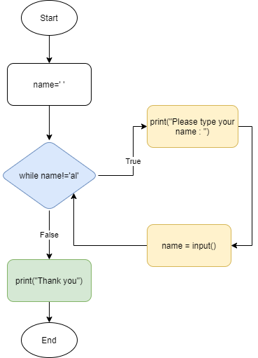

Some example of **enumerate()** and **zip()** methods use with for loop 

```python
>>> tup = ('a',123,True)
>>> 
>>> for item in enumerate(tup):
	print(item)

	
(0, 'a')
(1, 123)
(2, True)

>>> mylist1 = [1,2,3]
>>> mylist2 = ['a', 'b', 'c']
>>> mylist3 = [100, 200, 300]
 
>>> for item in zip(mylist1,mylist2, mylist3):
	print(item)
	
(1, 'a', 100)
(2, 'b', 200)
(3, 'c', 300)
>>> 
```

Quick example for the same 

```python
mylist4 = [1,2,3,4,5]
 
for a, b,c in zip(mylist1,mylist2, mylist3,mylist4):
	print(a, b, c, d)

# zip max can take 3 arguments 	
Traceback (most recent call last):
  File "<pyshell#42>", line 1, in <module>
    for a, b,c in zip(mylist1,mylist2, mylist3,mylist4):
ValueError: too many values to unpack (expected 3)
 
for a, b,c in zip(mylist1,mylist2,mylist4):
	print(a, b, c)

    # Prints out
	
1 a 1
2 b 2
3 c 3

list(zip())
[]
list(zip(mylist1,mylist2,mylist4))
[(1, 'a', 1), (2, 'b', 2), (3, 'c', 3)]
```

Quick check of the variable existenace in the list 

```python
>>> 2 in [1,2,3]
True
>>> 
>>> 'x' in ['y', 'z']
False
>>> 
>>> 'a' in 'a world'
True
>>> 
>>> 
>>> 'mykey' in {'mykey':123}
True
>>> d = {'mykey':123}
>>> 
>>> 123 in d.values()
True
```

